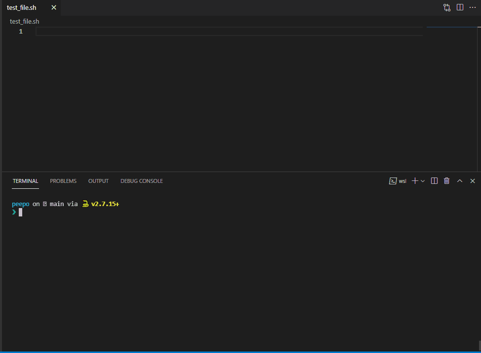

# peepo

[](https://github.com/sandro-h/peepo/actions/workflows/ci.yml)
[](https://sonarcloud.io/dashboard?id=sandro-h_peepo)


peepo allows to quickly iterate on a typical shell pipeline for data processing.

peepo takes a command file and executes each line as a shell command with the previous command's stdout as stdin.
So it runs the lines as though piped together.

peepo watches for changes in the command file and automatically executes changed lines. It uses cached results up to the first
changed line, so it does not needlessly re-run commands. This is similar to Dockerfiles where cached layers are reused if lines didn't change.

peepo is meant to run in an editor with integrated terminal, or with a split screen between editor and terminal, so you immediately see the
updated output of the pipeline as you make changes to the command file.



## Usage

```shell
./peepo <command file>
```

For more options, see:

```shell
./peepo --help
```

## Requirements

Python 3 (tested with Python 3.6+).

Currently only supports bash shell.

### Command keys

| Key | Function |
|-----|-----|
| `<up arrow key>` | Go to previous command in command file |
| `<down arrow key>` | Go to next command in command file |
| `<home key>` | Go to first command in command file |
| `<end key>` | Go to last command in command file |
| `r` | Rerun all commands without using cached output |

### peepo.bashrc

Executed commands do not use user's bashrc/profile because it can mess
with command execution. Instead, peepo sources `peepo.bashrc`, where you
can add whatever you want.

```shell
cp peepo.bashrc.tmpl peepo.bashrc
```

### Misc

Useful bash function to start peepo inside VSCode's integrated terminal:

```shell
# Create temporary input_file, open it in VSCode, start peepo
function tpeepo() {
    tmp_file=$(mktemp /tmp/peepoXXXXX.sh)
    code "$tmp_file"
    peepo "$tmp_file"
}
```

### Example command files

Process REST API result:

```shell
curl https://reqres.in/api/users?page=2
jq '.data[].first_name'
sed -r 's/^\s+|"//g'
tr '\n' ','
```

Mix in a shell block (useful for multi-line stuff):

```shell
curl https://reqres.in/api/users?page=2
jq '.data[]'
(sh
    while read line; do
        echo $line | wc -c
    done
sh)
```

Mix in a Python block:

```shell
curl https://reqres.in/api/users?page=2
jq '.data[0]'
(py
    # from_json is a helper function injected into all python blocks.
    # it reads stdin as json.
    data = from_json()
    print(data['first_name'])
py)
```
